# ExportInfoSkript

# Anleitung
- Danach klonen Sie das Repo [LINK](https://github.com/Egomann88/ExportInfoScript "LINK") oder laden sie Ordnerstruktur als ZIP herunter
- - Wenn Sie das ZIP wählen, sollten Sie es nach dem herunterladen in einem beliebigen Verzeichnis extrahieren
- Wurde die Ordnerstruktur richtig kopiert sollte es ungefähr so aussehen
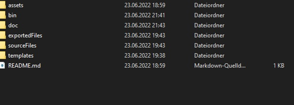
- Klicken Sie nun Oben auf die Ordnernamen und kopieren Sie den Angezeigten Pfad. Sie werden diesen später brauchen
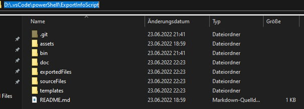
- Die Word-Dokumente, von denen die Kopf- und Fusszeile ersetz werden sollen, sollen in «SourceFiles» platziert werden
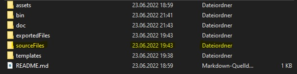
- Die Dokumente, mit der vorgegebenen Kopf- und Fusszeile werden in «templates» platziert
- - Um möglichst wenig ändern zu müssen, sollten Sie die Datei bestenfalls «template» heissen
- 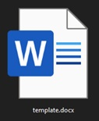
- Wurden alle Dateien erstellt und platziert; so gehen Sie in das «bin» Verzeichnis
- 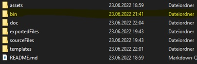
- Öffnen Sie nun die «WordReplaceHF» Datei
- 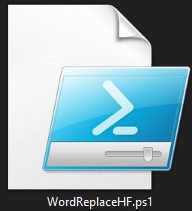
- 
- - Wird die Datei im Editor geöffnet, dann geben Sie in die Suchleiste unten Links und geben Sie «Windows PowerShell ISE» ein (wenn das Skript bereits im «PowerShell ISE» offen ist, gehen Sie sofort zu Schritt 8.)
- Als nächstes müssen sie die Skriptdatei öffnen.
- Dafür gehen Sie oben Link auf «Open…»
- Nun öffnet sich ein Fenster, in diesem wählen die die «WordReplaceHF» Datei aus
- 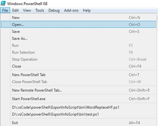
- Auf der neunten Zeile befindet sich ein Text, welcher «Nutzerpfade» heisst
- 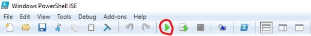
-  Den Dateipfad, welchen Sie bei Schritt 4 kopiert haben, fügen Sie nun zwischen den beiden Anführungszeichen von «rootSrc» ein.
-  - Wenn Ihre Vorlagedatei anders heisst, schreiben sie diesen nun bei «templateFilesName» ein (das .docx zu löschen)
- Nun drücken Sie «F5» auf Ihrer Tastatur oder Sie klicken auf den rot umkreisten Knopf
- 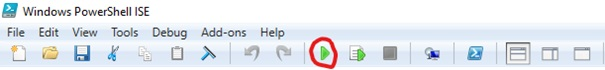
- Jetzt läuft das Skript, bitte haben Sie Geduld
- Warten Sie bis diese Nachricht erscheint: 
- Die fertigen Dokumente befinden sich nun im «exportedFiles» Verzeichnis
- 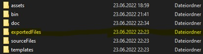
# Potenzielle Fehler
## Skript startet nicht
### Skripts sind deaktiviert
Steht irgendetwas davon, dass gewisse «Execution_Policies» deaktiviert sind, können sie diese wie folgt lösen:
- Geben Sie «Windows PowerShell» ein und wählen Sie diese App aus und starten sie diese als Administrator (Wenn Sie PowerShell nicht als Administrator ausführen können, wenden Sie sich an ihren Systemadministrator)
- Wurde PowerShell geöffnet, dann geben Sie Set-ExecutionPolicy Unrestricted und anschliessen ein J ein
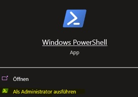

### Illegales Zeichen im Pfad
Kommt diese Meldung, existiert Ihr eingefügter Pfad nicht oder besitzt unerlaubte Zeichen.
Sie sollten Ihren Pfad überprüfen und bearbeiten.

### Keins oder nicht alle Word Dokumente werden kopiert
Dieses Problem kann durch zwei Dinge auftreten:
- Die Word Dokumente sind schreibgeschützt. In diesem Fall, öffen Sie die Dokumente manuell und aktivieren Sie die Bearbeitung.
- Wenn Sie andere Word Dokumente öffnen, während das Skript läuft, kann es unterbrochen werden

# Sofort nach dem klonen machen
- `git checkout <Euer Branch>` um den Branch zu wechseln
- Euer Branch heisst gleich, wie ihr mit Vornamen.

# Aufgabe
Wir sollen alles (inkl. Formatierungen , Links und co.) aus dem Body eines Word Dokuments kopieren.
Die kopierten Daten sollen in ein anders Doc mit vorgefertigten Header und Footer eingefügt und abgespeichert werden.
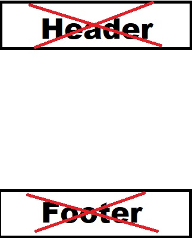

# Wie wir vorgehen
## Branches
- Jeder hat einen eigenen Branch und bleibt erstmal auf diesem.
- Wenn wir einen Lösungsansatz haben wird der Branch auf `main` gepush und alle bearbeiten diesen

## Branch wechseln
- `git checkout <Euer Branch>`
- https://www.freecodecamp.org/news/git-switch-branch/
